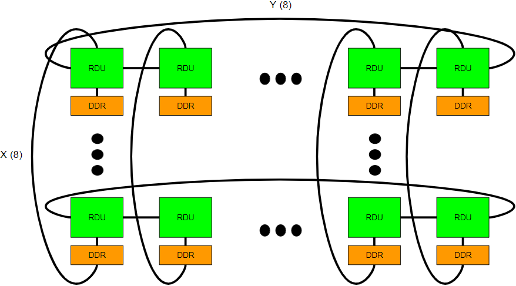

# Introduction
DFModel is used to model workload performance on a distributed system of accelerators. It uses Gurobi for optimization given the input constraints set up by users. The following images show the flow chart of DFModel. It goes through two steps of optimization from inter-chip level to intra-chip level. Inter-chip optimization figures out the best sharding strategy given a certain dataflow graph. Intra-chip level optimization figures out the mapping for each kernel on the accelerator and calculates the overall performance.

# Overall flow chart


# Detailed flow chart


# Environment
Gurobi 10.0.3<br />
Python 3.11.5<br />
libprotoc 3.20.3<br />
pydot 1.4.2<br />
h5py 3.9.0<br />

# How to use
1. Create a directory.
2. Assume the directory you created is `dir`, set up the input Protobuf text file in this path: `dir/user_input/setup.txt`.
3. Run DFModel using this command: `./run.sh dir`.

# How to set up the input protobuf file
The most important thing to do for a user is to set up the protobuf text file in step 1. The file contains information for the dataflow graph, system, cost, execution, and Gurobi.

## Dataflow graph
Set up the dataflow graph which describes the workload. It consists of kernels and connections. Kernels represent the computation kernels such as a matrix multiplication (GEMM) or an element-wise operation (ReLU) in a dataflow graph. Connections represent the intermediate connections between kernels, which correspond to intermediate buffers such as the activation between two MLP layers. The table summarizes the fields in the `dataflow_graph` message.

Message|Field|Must Fill|Unit|If not filled|Description
:-----:|:-----:|:-----:|:-----:|:-----:|:-----:
`dataflow_graph`|`kernels`|yes|N/A|N/A|compute kernels in a graph
`dataflow_graph`|`connections`|yes|N/A|N/A|buffers in a graph

It's recommended that you use generators in `generator/` to generate the dataflow graph for LLM/DLRM/HPL/FFT applications. The tables summarize the input arguments to the generators.

For LLM workloads, use `generator/generate_LLM_fwd.py` or `generator/generate_LLM_fwdbwd.py`.
Workload|Input Argument|Must Fill|Description
:-----:|:-----:|:-----:|:-----:
LLM|`hidden`|yes|hidden dimension of LLM
LLM|`seq`|yes|sequence length of LLM
LLM|`num_head`|yes|number of heads of LLM
LLM|`head_dim`|yes|head dimension of LLM
LLM|`word`|yes|number of bytes in the datatype

For DLRM workloads, use `generator/generate_DLRM_fwdbwd.py`.
Workload|Input Argument|Must Fill|Description
:-----:|:-----:|:-----:|:-----:
DLRM|`mlp_dim`|yes|dimension of MLP
DLRM|`bottom_num_mlp`|yes|number of MLPs at the bottom
DLRM|`top_num_mlp`|yes|number of MLPs at the top
DLRM|`pooled_row`|yes|number of rows pooled from the emb table
DLRM|`row`|yes|number of rows in the emb table
DLRM|`num_table`|yes|number of emb tables
DLRM|`emb_dim`|yes|dimenion of embeddings
DLRM|`num_chip`|yes|number of chips in the system
DLRM|`micro_batch_size`|yes|local batch size for MLPs
DLRM|`word`|yes|number of bytes in the datatype

For HPL workloads, use `generator/generate_HPL.py`.
Workload|Input Argument|Must Fill|Description
:-----:|:-----:|:-----:|:-----:
HPL|`N`|yes|side of a square matrix for factorization
HPL|`B`|yes|block size of the matrix
HPL|`X`|yes|number of chips along the first dimension of the matrix
HPL|`Y`|yes|number of chips along the second dimension of the matrix
HPL|`word`|yes|number of bytes in the datatype

For FFT workloads, use `generator/generate_FFT.py`.
Workload|Input Argument|Must Fill|Description
:-----:|:-----:|:-----:|:-----:
FFT|`length`|yes|length of FFT
FFT|`num_chip`|yes|number of chips in the system
FFT|`word`|yes|number of bytes in the datatype

## System
Set up the system. The system consists of compute, memory, and network components. The compute component is the accelerator in the system. You can set up the number of chips and the detailed architectural details of the chip. The memory component is the main memory attached to the accelerator. You can set up characteristics such as bandwidth and capacity. The network component is the interconnection network which connects all the accelerators in the system. The network is hierarchical and you can set up the characteristics for each dimension. You can set up the degree, bandwidth, and topology of each dimension. The table summarizes the fields in the `system` message. There are many topologies to choose in `src/setup.proto`, and here we show a 3D torus as one example.

Message|Field|Must Fill|Unit|If not filled|Description
:-----:|:-----:|:-----:|:-----:|:-----:|:-----:
`system`|`num_chip`|yes|N/A|N/A|number of chips in the system
`system`|`accelerator`|yes|N/A|N/A|micro-architectural details of one accelerator
`accelerator`|`core`|yes|N/A|N/A|number of cores in the accelerator
`accelerator`|`systolic_width`|yes|N/A|N/A|width of one systolic core
`accelerator`|`systolic_height`|yes|N/A|N/A|height of one systolic core
`accelerator`|`sram_cap`|yes|Bytes|N/A|capacity of on-chip SRAM
`accelerator`|`freq`|yes|GHz|N/A|frequency of the accelerator
`memory`|`dram_bw`|yes|GB/s|N/A|DRAM bandwidth
`memory`|`dram_cap`|yes|Bytes|N/A|DRAM capacity
`topology_variant`|`r_r_r`|yes|N/A|N/A|`r_r_r` represents a 3D torus since all three dimensions of the torus is a basic ring, we follow the notation to define the basic dimension of a hierarchical topology like this: ring (r), switch (sw), fully-connected (fc), other topologies are shown in `setup.proto`
`r_r_r`|`x`|no|N/A|you can leave `x`, `y`, `z` blank simultaneously and DFModel automatically searches for the best degree for each dimension|degree for the X dimension
`r_r_r`|`y`|no|N/A|you can leave `x`, `y`, `z` blank simultaneously and DFModel automatically searches for the best degree for each dimension|degree for the Y dimension
`r_r_r`|`z`|no|N/A|you can leave `x`, `y`, `z` blank simultaneously and DFModel automatically searches for the best degree for each dimension|degree for the Z dimension
`r_r_r`|`link_bw_x`|yes|GB/s|N/A|link bandwidth for the interconnect on the X dimension
`r_r_r`|`link_bw_y`|yes|GB/s|N/A|link bandwidth for the interconnect on the Y dimension
`r_r_r`|`link_bw_z`|yes|GB/s|N/A|link bandwidth for the interconnect on the Z dimension
`r_r_r`|`par_x`|no|N/A|`TP`: tensor parallelism, `PP`: pipeline parallelism, `DP`: data parallelism (only set it for LLM, no need to set for DLRM/HPL/FFT|parallelization strategy on the X dimension)
`r_r_r`|`par_y`|no|N/A|`TP`: tensor parallelism, `PP`: pipeline parallelism, `DP`: data parallelism (only set it for LLM, no need to set for DLRM/HPL/FFT|parallelization strategy on the X dimension)
`r_r_r`|`par_z`|no|N/A|`TP`: tensor parallelism, `PP`: pipeline parallelism, `DP`: data parallelism (only set it for LLM, no need to set for DLRM/HPL/FFT|parallelization strategy on the X dimension)

## Cost
Set up price cost and power consumption for the system, which consists of compute, memory, and network parts. The compute component includes price/power of the accelerator die. The memory component includes price/power of DRAM. The network component includes price/power of the interconnect in a hierarchical topology. The table summarizes the fields in the `cost` message.

Message|Field|Must Fill|Unit|If not filled|Description
:-----:|:-----:|:-----:|:-----:|:-----:|:-----:
`cost`|`link_unit_price`|yes|$/(GB/s)|N/A|dollar price per bandwidth for link
`cost`|`switch_unit_price`|yes|$/(GB/s*radix)|N/A|dollar price per bandwidth per radix for switch
`cost`|`dram_unit_price`|yes|$/(GB/s)|N/A|dollar price per bandwidth for DRAM
`cost`|`accelerator_price`|yes|$|N/A|dollar price of the accelerator die
`cost`|`link_unit_power_x`|no|J/GB|depends on topology, if not filled, value is 0|energy consumption per byte accessed on link in the X dimension
`cost`|`link_unit_power_y`|no|J/GB|depends on topology, if not filled, value is 0|energy consumption per byte accessed on link in the Y dimension
`cost`|`link_unit_power_z`|no|J/GB|depends on topology, if not filled, value is 0|energy consumption per byte accessed on link in the Z dimension
`cost`|`switch_unit_power`|yes|J/(GB*radix)|N/A|energy consumption per bandwidth per radix for switch
`cost`|`dram_unit_power`|yes|J/GB|N/A|energy consumption per byte accessed from DRAM
`cost`|`accelerator_power`|yes|W|N/A|power consumption of the accelerator die

## Execution
Set up miscellaneous constraints. You can set up execution style for the workload which includes kernel-by-kernel execution and dataflow execution. Dataflow execution means DFModel automatically searches for the kernel fusion into different configurations. You can also specify other parameters such as the number of configurations and the number of bytes of the datatype. There are also workload-dependent constraints. For example, for LLM training workloads, you can specify the global batch size and local batch size. The following table shows the fields in the `execution` message.

Message|Field|Must Fill|Unit|If not filled|Description
:-----:|:-----:|:-----:|:-----:|:-----:|:-----:
`execution`|`execution_style`|yes|N/A|N/A|`DATAFLOW` or `KERNEL_BY_KERNEL`: dataflow automatically fuses kernels into different configurations, kernel-by-kernel puts every kernel into a different configuration
`execution`|`num_config`|no|N/A|if not specified, num_config is equal to the number of kernels|you can set a number for dataflow, no need to set for kernel-by-kernel
`execution`|`perfect_overlap`|yes|N/A|N/A|if true, overlap the compute/memory/network latency for each configuration
`execution`|`compute_util`|no|N/A|if not specified, DFModel automatically calculates the compute latency based on the accelerator's TFLOPS|if specified, DFModel assumes the TFLOPS utilization (compute only) to be the specified number, it can significantly reduce DFModel's runtime

## Gurobi
Set up Gurobi-related constraints. You can control the runtime, gap, and the number of threads used. The following table shows the fields in the `gurobi` message.

Message|Field|Must Fill|Unit|If not filled|Description
:-----:|:-----:|:-----:|:-----:|:-----:|:-----:
`gurobi`|`thread`|no|N/A|if not specified, default to 20 threads|number of threads used for Gurobi program
`gurobi`|`gap`|no|N/A|if not specified, default to 0.01|MIPGap for Gurobi program
`gurobi`|`time`|no|second|if not specified, default to infinite time (run until completion)|runtime for Gurobi program

# Example
We go through an example of training GPT-3 1T model on 1024 SambaNova SN30 RDUs.

## Input dataflow graph
We first use the LLM generator in `generator/generate_LLM_fwdbwd.py` to generate the dataflow graph, which looks like the following. You can use the command `python generator/generate_LLM_fwdbwd.py --hidden=25600 --num_head=160 --head_dim=160 --seq=2048 --word=2` to generate the dataflow graph for GPT3 1T model with 160 heads, 160 head size, and 2048 sequence length. The following generated code shows the input code for DFModel for one layer of GPT3 1T.
```
kernels {
  name: "Add_Prev_Layer"
  id: 1
  config: -1
  fwd_bwd: FWD
  type: SIMD
  elementwise_input1 {
    outer: 1
    M: 25600
    N: 2048
    input_tensor_size: 104857600.0
    output_tensor_size: 104857600.0
    tiling: N_TILING
  }
}
kernels {
  name: "LayerNorm_1"
  id: 2
  config: -1
  fwd_bwd: FWD
  type: SIMD
  elementwise_input1 {
    outer: 1
    M: 25600
    N: 2048
    input_tensor_size: 104857600.0
    output_tensor_size: 104857600.0
    tiling: N_TILING
  }
}
kernels {
  name: "Q"
  id: 3
  config: -1
  fwd_bwd: FWD
  type: SYSTOLIC
  gemm_input1_weight {
    outer: 160
    M: 160
    K: 25600
    N: 2048
    input_tensor_size: 104857600.0
    weight_tensor_size: 1310720000.0
    output_tensor_size: 104857600.0
    tiling: N_TILING
  }
}
kernels {
  name: "K"
  id: 4
  config: -1
  fwd_bwd: FWD
  type: SYSTOLIC
  gemm_input1_weight {
    outer: 160
    M: 160
    K: 25600
    N: 2048
    input_tensor_size: 104857600.0
    weight_tensor_size: 1310720000.0
    output_tensor_size: 104857600.0
    tiling: N_TILING
  }
}
kernels {
  name: "V"
  id: 5
  config: -1
  fwd_bwd: FWD
  type: SYSTOLIC
  gemm_input1_weight {
    outer: 160
    M: 160
    K: 25600
    N: 2048
    input_tensor_size: 104857600.0
    weight_tensor_size: 1310720000.0
    output_tensor_size: 104857600.0
    tiling: N_TILING
  }
}
kernels {
  name: "MHA_GEMM_1"
  id: 6
  config: -1
  fwd_bwd: FWD
  type: SYSTOLIC
  gemm_input1_input2 {
    outer: 160
    M: 2048
    K: 160
    N: 2048
    input_tensor_1_size: 104857600.0
    input_tensor_2_size: 104857600.0
    output_tensor_size: 1342177300.0
    tiling: N_TILING
  }
}
kernels {
  name: "SOFTMAX"
  id: 7
  config: -1
  fwd_bwd: FWD
  type: SIMD
  elementwise_input1 {
    outer: 160
    M: 2048
    N: 2048
    input_tensor_size: 1342177300.0
    output_tensor_size: 1342177300.0
    tiling: N_TILING
  }
}
kernels {
  name: "DropOut_1"
  id: 8
  config: -1
  fwd_bwd: FWD
  type: SIMD
  elementwise_input1 {
    outer: 160
    M: 2048
    N: 2048
    input_tensor_size: 1342177300.0
    output_tensor_size: 1342177300.0
    tiling: N_TILING
  }
}
kernels {
  name: "MHA_GEMM_2"
  id: 9
  config: -1
  fwd_bwd: FWD
  type: SYSTOLIC
  gemm_input1_input2 {
    outer: 160
    M: 160
    K: 2048
    N: 2048
    input_tensor_1_size: 104857600.0
    input_tensor_2_size: 1342177300.0
    output_tensor_size: 104857600.0
    tiling: N_TILING
  }
}
kernels {
  name: "PROJ_GEMM"
  id: 10
  config: -1
  fwd_bwd: FWD
  type: SYSTOLIC
  gemm_input1_weight {
    outer: 1
    M: 25600
    K: 25600
    N: 2048
    input_tensor_size: 104857600.0
    weight_tensor_size: 1310720000.0
    output_tensor_size: 104857600.0
    tiling: N_TILING
  }
}
kernels {
  name: "DropOut_2"
  id: 11
  config: -1
  fwd_bwd: FWD
  type: SIMD
  elementwise_input1 {
    outer: 1
    M: 25600
    N: 2048
    input_tensor_size: 104857600.0
    output_tensor_size: 104857600.0
    tiling: N_TILING
  }
}
kernels {
  name: "Add_1"
  id: 12
  config: -1
  fwd_bwd: FWD
  type: SIMD
  elementwise_input1_input2 {
    outer: 1
    M: 25600
    N: 2048
    input_tensor_1_size: 104857600.0
    output_tensor_size: 104857600.0
    tiling: N_TILING
    input_tensor_2_size: 104857600.0
  }
}
kernels {
  name: "LayerNorm_2"
  id: 13
  config: -1
  fwd_bwd: FWD
  type: SIMD
  elementwise_input1 {
    outer: 1
    M: 25600
    N: 2048
    input_tensor_size: 104857600.0
    output_tensor_size: 104857600.0
    tiling: N_TILING
  }
}
kernels {
  name: "FFN0"
  id: 14
  config: -1
  fwd_bwd: FWD
  type: SYSTOLIC
  gemm_input1_weight {
    outer: 1
    M: 102400
    K: 25600
    N: 2048
    input_tensor_size: 104857600.0
    weight_tensor_size: 5242880000.0
    output_tensor_size: 419430400.0
    tiling: N_TILING
  }
}
kernels {
  name: "GeLU"
  id: 15
  config: -1
  fwd_bwd: FWD
  type: SIMD
  elementwise_input1 {
    outer: 1
    M: 102400
    N: 2048
    input_tensor_size: 419430400.0
    output_tensor_size: 419430400.0
    tiling: N_TILING
  }
}
kernels {
  name: "FFN1"
  id: 16
  config: -1
  fwd_bwd: FWD
  type: SYSTOLIC
  gemm_input1_weight {
    outer: 1
    M: 25600
    K: 102400
    N: 2048
    input_tensor_size: 419430400.0
    weight_tensor_size: 5242880000.0
    output_tensor_size: 104857600.0
    tiling: N_TILING
  }
}
kernels {
  name: "DropOut_3"
  id: 17
  config: -1
  fwd_bwd: FWD
  type: SIMD
  elementwise_input1 {
    outer: 1
    M: 25600
    N: 2048
    input_tensor_size: 104857600.0
    output_tensor_size: 104857600.0
    tiling: N_TILING
  }
}
kernels {
  name: "Add_2"
  id: 18
  config: -1
  fwd_bwd: FWD
  type: SIMD
  elementwise_input1_input2 {
    outer: 1
    M: 25600
    N: 2048
    input_tensor_1_size: 104857600.0
    output_tensor_size: 104857600.0
    tiling: N_TILING
    input_tensor_2_size: 104857600.0
  }
}
kernels {
  name: "Loss_bwd"
  id: 19
  config: -1
  fwd_bwd: BWD
  type: SIMD
  elementwise_input1 {
    outer: 1
    M: 25600
    N: 2048
    input_tensor_size: 104857600.0
    output_tensor_size: 104857600.0
    tiling: N_TILING
  }
}
kernels {
  name: "DropOut_3_bwd"
  id: 20
  config: -1
  fwd_bwd: BWD
  type: SIMD
  elementwise_input1 {
    outer: 1
    M: 25600
    N: 2048
    input_tensor_size: 104857600.0
    output_tensor_size: 104857600.0
    tiling: N_TILING
  }
}
kernels {
  name: "FFN1_bwd"
  id: 21
  config: -1
  fwd_bwd: BWD
  type: SYSTOLIC
  gemm_input1_weight {
    outer: 1
    M: 102400
    K: 25600
    N: 2048
    input_tensor_size: 104857600.0
    weight_tensor_size: 5242880000.0
    output_tensor_size: 419430400.0
    tiling: N_TILING
  }
}
kernels {
  name: "GeLU_bwd"
  id: 22
  config: -1
  fwd_bwd: BWD
  type: SIMD
  elementwise_input1 {
    outer: 1
    M: 102400
    N: 2048
    input_tensor_size: 419430400.0
    output_tensor_size: 419430400.0
    tiling: N_TILING
  }
}
kernels {
  name: "FFN0_bwd"
  id: 23
  config: -1
  fwd_bwd: BWD
  type: SYSTOLIC
  gemm_input1_weight {
    outer: 1
    M: 25600
    K: 102400
    N: 2048
    input_tensor_size: 419430400.0
    weight_tensor_size: 5242880000.0
    output_tensor_size: 104857600.0
    tiling: N_TILING
  }
}
kernels {
  name: "LayerNorm_2_bwd"
  id: 24
  config: -1
  fwd_bwd: BWD
  type: SIMD
  elementwise_input1 {
    outer: 1
    M: 25600
    N: 2048
    input_tensor_size: 104857600.0
    output_tensor_size: 104857600.0
    tiling: N_TILING
  }
}
kernels {
  name: "DropOut_2_bwd"
  id: 25
  config: -1
  fwd_bwd: BWD
  type: SIMD
  elementwise_input1 {
    outer: 1
    M: 25600
    N: 2048
    input_tensor_size: 104857600.0
    output_tensor_size: 104857600.0
    tiling: N_TILING
  }
}
kernels {
  name: "PROJ_GEMM_bwd"
  id: 26
  config: -1
  fwd_bwd: BWD
  type: SYSTOLIC
  gemm_input1_weight {
    outer: 1
    M: 25600
    K: 25600
    N: 2048
    input_tensor_size: 104857600.0
    weight_tensor_size: 1310720000.0
    output_tensor_size: 104857600.0
    tiling: N_TILING
  }
}
kernels {
  name: "MHA_GEMM_2_bwd1"
  id: 27
  config: -1
  fwd_bwd: BWD
  type: SYSTOLIC
  gemm_input1_input2 {
    outer: 160
    M: 2048
    K: 160
    N: 2048
    input_tensor_1_size: 104857600.0
    input_tensor_2_size: 104857600.0
    output_tensor_size: 1342177300.0
    tiling: N_TILING
  }
}
kernels {
  name: "MHA_GEMM_2_bwd2"
  id: 28
  config: -1
  fwd_bwd: BWD
  type: SYSTOLIC
  gemm_input1_input2 {
    outer: 160
    M: 160
    K: 2048
    N: 2048
    input_tensor_1_size: 104857600.0
    input_tensor_2_size: 1342177300.0
    output_tensor_size: 104857600.0
    tiling: N_TILING
  }
}
kernels {
  name: "V_bwd"
  id: 29
  config: -1
  fwd_bwd: BWD
  type: SYSTOLIC
  gemm_input1_weight {
    outer: 1
    M: 25600
    K: 25600
    N: 2048
    input_tensor_size: 104857600.0
    weight_tensor_size: 1310720000.0
    output_tensor_size: 104857600.0
    tiling: N_TILING
  }
}
kernels {
  name: "DropOut_1_bwd"
  id: 30
  config: -1
  fwd_bwd: BWD
  type: SIMD
  elementwise_input1 {
    outer: 160
    M: 2048
    N: 2048
    input_tensor_size: 1342177300.0
    output_tensor_size: 1342177300.0
    tiling: N_TILING
  }
}
kernels {
  name: "SOFTMAX_bwd"
  id: 31
  config: -1
  fwd_bwd: BWD
  type: SIMD
  elementwise_input1 {
    outer: 160
    M: 2048
    N: 2048
    input_tensor_size: 1342177300.0
    output_tensor_size: 1342177300.0
    tiling: N_TILING
  }
}
kernels {
  name: "MHA_GEMM_1_bwd1"
  id: 32
  config: -1
  fwd_bwd: BWD
  type: SYSTOLIC
  gemm_input1_input2 {
    outer: 160
    M: 160
    K: 2048
    N: 2048
    input_tensor_1_size: 1342177300.0
    input_tensor_2_size: 104857600.0
    output_tensor_size: 104857600.0
    tiling: N_TILING
  }
}
kernels {
  name: "MHA_GEMM_1_bwd2"
  id: 33
  config: -1
  fwd_bwd: BWD
  type: SYSTOLIC
  gemm_input1_input2 {
    outer: 160
    M: 160
    K: 2048
    N: 2048
    input_tensor_1_size: 1342177300.0
    input_tensor_2_size: 104857600.0
    output_tensor_size: 104857600.0
    tiling: N_TILING
  }
}
kernels {
  name: "Q_bwd"
  id: 34
  config: -1
  fwd_bwd: BWD
  type: SYSTOLIC
  gemm_input1_weight {
    outer: 160
    M: 160
    K: 25600
    N: 2048
    input_tensor_size: 104857600.0
    weight_tensor_size: 1310720000.0
    output_tensor_size: 104857600.0
    tiling: N_TILING
  }
}
kernels {
  name: "K_bwd"
  id: 35
  config: -1
  fwd_bwd: BWD
  type: SYSTOLIC
  gemm_input1_weight {
    outer: 160
    M: 160
    K: 25600
    N: 2048
    input_tensor_size: 104857600.0
    weight_tensor_size: 1310720000.0
    output_tensor_size: 104857600.0
    tiling: N_TILING
  }
}
kernels {
  name: "FFN1_bwd_weight_update"
  id: 36
  config: -1
  fwd_bwd: BWD
  type: SYSTOLIC
  gemm_input1_input2 {
    outer: 1
    M: 102400
    K: 2048
    N: 25600
    input_tensor_1_size: 104857600.0
    input_tensor_2_size: 419430400.0
    output_tensor_size: 5242880000.0
    communication_type: ALL_REDUCE_PERIODIC
    communication_size: 5242880000.0
    tiling: K_TILING
  }
}
kernels {
  name: "FFN0_bwd_weight_update"
  id: 37
  config: -1
  fwd_bwd: BWD
  type: SYSTOLIC
  gemm_input1_input2 {
    outer: 1
    M: 25600
    K: 2048
    N: 102400
    input_tensor_1_size: 419430400.0
    input_tensor_2_size: 104857600.0
    output_tensor_size: 5242880000.0
    communication_type: ALL_REDUCE_PERIODIC
    communication_size: 5242880000.0
    tiling: K_TILING
  }
}
kernels {
  name: "PROJ_GEMM_bwd_weight_update"
  id: 38
  config: -1
  fwd_bwd: BWD
  type: SYSTOLIC
  gemm_input1_input2 {
    outer: 1
    M: 25600
    K: 2048
    N: 25600
    input_tensor_1_size: 104857600.0
    input_tensor_2_size: 104857600.0
    output_tensor_size: 1310720000.0
    communication_type: ALL_REDUCE_PERIODIC
    communication_size: 1310720000.0
    tiling: K_TILING
  }
}
kernels {
  name: "V_bwd_weight_update"
  id: 39
  config: -1
  fwd_bwd: BWD
  type: SYSTOLIC
  gemm_input1_input2 {
    outer: 1
    M: 25600
    K: 2048
    N: 25600
    input_tensor_1_size: 104857600.0
    input_tensor_2_size: 104857600.0
    output_tensor_size: 1310720000.0
    communication_type: ALL_REDUCE_PERIODIC
    communication_size: 1310720000.0
    tiling: K_TILING
  }
}
kernels {
  name: "K_bwd_weight_update"
  id: 40
  config: -1
  fwd_bwd: BWD
  type: SYSTOLIC
  gemm_input1_input2 {
    outer: 1
    M: 25600
    K: 2048
    N: 25600
    input_tensor_1_size: 104857600.0
    input_tensor_2_size: 104857600.0
    output_tensor_size: 1310720000.0
    communication_type: ALL_REDUCE_PERIODIC
    communication_size: 1310720000.0
    tiling: K_TILING
  }
}
kernels {
  name: "Q_bwd_weight_update"
  id: 41
  config: -1
  fwd_bwd: BWD
  type: SYSTOLIC
  gemm_input1_input2 {
    outer: 1
    M: 25600
    K: 2048
    N: 25600
    input_tensor_1_size: 104857600.0
    input_tensor_2_size: 104857600.0
    output_tensor_size: 1310720000.0
    communication_type: ALL_REDUCE_PERIODIC
    communication_size: 1310720000.0
    tiling: K_TILING
  }
}
connections {
  startIdx: 1
  endIdx: 2
  id: 1
}
connections {
  startIdx: 2
  endIdx: 3
  id: 2
}
connections {
  startIdx: 2
  endIdx: 4
  id: 3
}
connections {
  startIdx: 2
  endIdx: 5
  id: 4
}
connections {
  startIdx: 3
  endIdx: 6
  id: 5
}
connections {
  startIdx: 4
  endIdx: 6
  id: 6
}
connections {
  startIdx: 6
  endIdx: 7
  id: 7
}
connections {
  startIdx: 7
  endIdx: 8
  id: 8
}
connections {
  startIdx: 5
  endIdx: 9
  id: 9
}
connections {
  startIdx: 8
  endIdx: 9
  id: 10
}
connections {
  startIdx: 9
  endIdx: 10
  id: 11
}
connections {
  startIdx: 10
  endIdx: 11
  id: 12
}
connections {
  startIdx: 11
  endIdx: 12
  id: 13
}
connections {
  startIdx: 1
  endIdx: 12
  id: 14
}
connections {
  startIdx: 12
  endIdx: 13
  id: 15
}
connections {
  startIdx: 13
  endIdx: 14
  id: 16
}
connections {
  startIdx: 14
  endIdx: 15
  id: 17
}
connections {
  startIdx: 15
  endIdx: 16
  id: 18
}
connections {
  startIdx: 16
  endIdx: 17
  id: 19
}
connections {
  startIdx: 17
  endIdx: 18
  id: 20
}
connections {
  startIdx: 12
  endIdx: 18
  id: 21
}
connections {
  startIdx: 19
  endIdx: 20
  id: 22
}
connections {
  startIdx: 20
  endIdx: 21
  id: 23
}
connections {
  startIdx: 21
  endIdx: 22
  id: 24
}
connections {
  startIdx: 22
  endIdx: 23
  id: 25
}
connections {
  startIdx: 23
  endIdx: 24
  id: 26
}
connections {
  startIdx: 24
  endIdx: 25
  id: 27
}
connections {
  startIdx: 25
  endIdx: 26
  id: 28
}
connections {
  startIdx: 26
  endIdx: 27
  id: 29
}
connections {
  startIdx: 5
  endIdx: 27
  id: 30
}
connections {
  startIdx: 26
  endIdx: 28
  id: 31
}
connections {
  startIdx: 8
  endIdx: 28
  id: 32
}
connections {
  startIdx: 27
  endIdx: 30
  id: 33
}
connections {
  startIdx: 28
  endIdx: 29
  id: 34
}
connections {
  startIdx: 30
  endIdx: 31
  id: 35
}
connections {
  startIdx: 31
  endIdx: 32
  id: 36
}
connections {
  startIdx: 31
  endIdx: 33
  id: 37
}
connections {
  startIdx: 4
  endIdx: 32
  id: 38
}
connections {
  startIdx: 3
  endIdx: 33
  id: 39
}
connections {
  startIdx: 32
  endIdx: 34
  id: 40
}
connections {
  startIdx: 33
  endIdx: 35
  id: 41
}
connections {
  startIdx: 20
  endIdx: 36
  id: 42
}
connections {
  startIdx: 15
  endIdx: 36
  id: 43
}
connections {
  startIdx: 22
  endIdx: 37
  id: 44
}
connections {
  startIdx: 13
  endIdx: 37
  id: 45
}
connections {
  startIdx: 25
  endIdx: 38
  id: 46
}
connections {
  startIdx: 9
  endIdx: 38
  id: 47
}
connections {
  startIdx: 28
  endIdx: 39
  id: 48
}
connections {
  startIdx: 2
  endIdx: 39
  id: 49
}
connections {
  startIdx: 33
  endIdx: 40
  id: 50
}
connections {
  startIdx: 2
  endIdx: 40
  id: 51
}
connections {
  startIdx: 32
  endIdx: 41
  id: 52
}
connections {
  startIdx: 2
  endIdx: 41
  id: 53
}
```
The following graph shows the different kernels and buffers corresponding to the dataflow graph above.


## System
The system is composed of 1024 SN30 RDUs. Each RDU has more than 600 MB of SRAM and more than 600 TFLOPS of compute power. Each chip is attched with 1TB of DDR memory. The interconnection topolopy is a 8x128 2D torus with PCIe links connecting both dimensions of the hierarchical topology. The parallelization strategy is `TP` (tensor parallelism) on the dimension with degree 8 and `PP` (pipeline parallelism) on the dimension with degree 128. The following code shows the system setup for the described system.
```
system {
  num_chip: 1024
  accelerator {
    core: 1280
    systolic_width: 32
    systolic_height: 6
    sram_cap: 671088640.0
    freq: 1.25
  }
  r_r {
    x: 8
    y: 128
    link_bw_x: 50.0
    link_bw_y: 50.0
    par_x: "TP"
    par_y: "PP"
  }
  memory {
    dram_bw: 300.0
    dram_cap: 1099511600000.0
  }
}
```
The following image shows the system setup.


## Cost
We set up the cost of the system which includes both price cost and power cost. We need to set up the unit cost for the interconnection links, switches, DRAM as well as the cost of the accelerator silicon. The following code shows an example.
```
cost {
	accelerator_price: 16522.25023
	accelerator_power: 444.7061955
	dram_unit_price: 1.0
	dram_unit_power: 0.16248
	link_unit_price: 2.0
	link_unit_power_x: 0.052
	link_unit_power_y: 0.052
	switch_unit_price: 24.0
	switch_unit_power: 0.052
}
```

## Execution
Since RDU is a dataflow architecture, we set the execution style to be `DATAFLOW`, which tells DFModel to automatically fuse kernels, and we set the overlap flag to be true, which tells DFModel to overlap compute/memory/network latencies. We also set the workload-dependent parameters such as the global batch size to be 3072 according to the workload specification. The following code shows the setup.
```
execution {
	execution_style: DATAFLOW
	num_config: 6
	perfect_overlap: true
	compute_util: 0.9
}
```

## Gurobi
We set up Gurobi-related variables including the number of threads, MIPGap, and runtime. The following code shows an example.
```
gurobi {
  thread: 144
  gap: 0.001
  time: 1200
}
```

## Results
The output dataflow graph shows the mapping, and the output text log shows various results like the following.
```
System Cost 17757184.0
System Power 511325.01135492325
Workload FLOP 3.85072240461978e+19
System FLOPS Utilization 0.7748055154407518
Optimizer Runtime (s) 262.675754070282
```
There are a total of six configurations and the following output graph shows six clusters of kernels.


